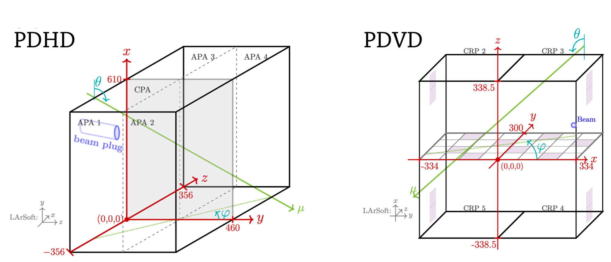

# Liquid Argon Reconstruction Done in PythON

# LARDON installation
:bangbang: ***LARDON now uses `uv` to manage its dependencies*** :bangbang:

Install `uv`:

`curl -LsSf https://astral.sh/uv/install.sh | sh`

you can learn more about `uv` here: https://github.com/astral-sh/uv

Go to the top lardon repository, and do:

`uv sync`

you can then either run lardon with:
`uv run lardon <options>`
or source `set_lardon.sh` where the lardon environment will be activated (type `deactivate` to disable it). This is the default method.

:warning: *if you previously added the `xrootd` package to your conda environment, you should remove it: `conda remove xrootd` as it messes up a lot of the server settings (like git, condor, ...)*

# Before running lardon
Check and modify `set_lardon.sh` if needed:
* *$LARDON_PATH*: where the lardon code lives
* *$LARDON_RECO*: where the reconstructed files will be stored

Check and modify files in `lardon/settings/the_detector/` :
* Update the runs configuration files in `geo.json` if needed [**with caution!**]
* Change the reconstruction parameters in `reco_parameters.json` if needed
* Update the raw files location in `path.json` if needed. LARDON search the requested `*hdf5` file in the `/directory` and in the subdirectories `/directory/ha/sh/`, `/directory/runnumber/` and in `/directory/ru/nu/mb/er`.
  	 
# To run lardon on data
To launch lardon, type `lardon` with the following arguments: 
**Mandatory**: 
* `-det <cb1top/cb1bot/cbtop/cbbot/dp/50l/pdhd/pdvd>` which detector 
* `-run <run nb>` which run number
* `-sub <subfile name>` which subfile (*e.g.* 1_a, 0) 
**These options may be also needed to retrieve the raw file**: 
* `-flow <flow nb> -writer <writer nb>` if used  
* `-hash <ab/cd>` the hashed sub-directory where the data is (use rucio to find out)  
* `-serv <server nb>` the server nb where the data was taken (may be needed for some PDVD runs, you can get it in the file name under the `-s0x-` part) 

**Alternatively, you can provide the whole path of the file:** 
Should be used for using files outside of cern/fermilab 
In such case you need to first get the justin/rucio authentication sorted 
in the `set_lardon.sh` script, the `$LD_PRELOAD` is automatically set to allow `xrootd` stram 
The option to use is: 
* `-file root://the.full.file.path.you.got.from.rucio.the_file.h5`

:exclamation: you still need to provide run and subfile numbers !  

**Depending on the requested reconstruction**: 
* `-trk` if you want the **charge/TPC** reconstruction 
* `-pds` if you want the **PDS** reconstruction [DOES NOT WORK FOR PDHD, okish for PDVD] 
**You can ask both!**

*Optional*: 
* `-n <nb of events>` how many events to process, default is -1 = all file
* `-out <output file option>` optional extra name for the output
* `-skip <nb to skip>` number of events to skip
* `-event <event number>` to analyze only one event
* `-pulse` To analyse charge pulsing (calibration) data
* `-online` If running as online monitoring (produces ED and control plots)

*e.g. 1* : To run TPC reco on event 11 of PDVD file `np02vd_raw_run039229_0024_df-s05-d4_dw_0_20250829T115242.hdf5` on lxplus: 

`lardon -det pdvd -run 39229 -sub 24 -flow 4 -writer 0 -serv 5 -hash 86/ad -event 11 -out one_event -trk`

the output h5file will be **$LARDON_RECO/pdvd_39229_24_40_one_event.h5**

*e.g. 2* : To run TPC reco on all events of PDVD file `np02vd_raw_run039246_0006_df-s04-d0_dw_0_20250829T152837.hdf5` :

`lardon -det pdvd -run 39246 -sub 6 -flow 0 -writer 0 -out full_example -trk`

the output h5file will be **$LARDON_RECO/pdvd_39246_00_full_example.h5**

*e.g. 3* : To run TPC on first 10 events of VD-CB file `np02vdcoldbox_raw_run037040_0023_df-s02-d0_dw_0_20250704T183417.hdf5` :

`lardon -det cbbot -run 37040 -sub 23 -hash 5a/a2  -n 10 -trk -out few_events`

NB: When `flow_nb` and `writer_nb` are both 0, you don't need to provide it.
The output h5file will be **$LARDON_RECO/cbbot_37040_23_few_events.h5**

*e.g. 4* : To run TPC & PDS reco on events 5 and 6 VD-CD file located at root://somewhere.abc:1094/directory/raw/data/np02vdcoldbox_raw_run037041_0079_df-s02-d0_dw_0_20250705T130324.hdf5

`lardon -det cbbot -run 37041 -sub 79 -file root://somewhere.abc:1094/directory/raw/data/np02vdcoldbox_raw_run037041_0079_df-s02-d0_dw_0_20250705T130324.hdf5 -n 6 -skip 4 -trk -pds -out evt_5_6_both_reco`

the output h5file will be **$LARDON_RECO/cbbot_37041_79_evt_5_6_both_reco.h5**

# LARDON Conventions
* In lardon, electrons drift along the third / `z` axis.
* All units are in cm.
* For **ProtoDUNE-II**, the origin of the (x,y,z) system matches LarSoft convention. 
* For other detectors (coldbox, 50L) the origin is at the center of the detector.

## ProtoDUNE-II

## VD-Coldbox

# Control Plots
:warning: The data is structured in `daq_channel` ordering, which can have a mix of views 

By default, no control plots is produced, but you can call the plotting functions in **workflow.py** anywhere in the reconstruction loop.

All plot functions have the two options : 
* option="extra_output_name_if_you_want" [default is none] 
* to_be_shown=True/False if you want to see the plot live [default is False]

### To plot the current event display: 
Seen in `daq_channel` ordering: 
`plot.plot_event_display_per_daqch()` 
Seen in view channel ordering (more natural): 
`plot.plot_event_display_per_view()` 

### To plot the current waveform(s): 
`plot.plot_wvf_current_daqch([daq_ch_1, daq_ch_2, ...])` 
`plot.plot_wvf_current_vch([(view,ch1),(view,ch2),(...)])` 

### To plot the noise RMS 
`plot.plot_noise_daqch(noise_type='noise_type')` 
`plot.plot_noise_vch(noise_type='noise_type')` 
where `noise_type` is either `raw` or `filt` 

### To check the signal/noise separation on the event display: 
The signal (ROI) : `plot.event_display_per_view_roi()` 
The noise : `plot.event_display_per_view_noise()` 
The found hits on the ED: `plot.event_display_per_view_hits_found()` 

### To plot hits found : 
`plot.plot_2dview_hits()` 

### To plot 2D tracks (and hits): 
`plot.plot_2dview_2dtracks()` 

### To plot 3D tracks: 
`plot.plot_2dview_hits_and_3dtracks()` <- see the 3D tracks projected in 2D 
`plot.plot_3d()` <- see the 3D tracks in 3D 

### To plot the PDS waveforms: 
`plot.draw_pds_ED(draw_peak=True, roi=True)` <- also shows the reconstructed PDS peaks and ROI
