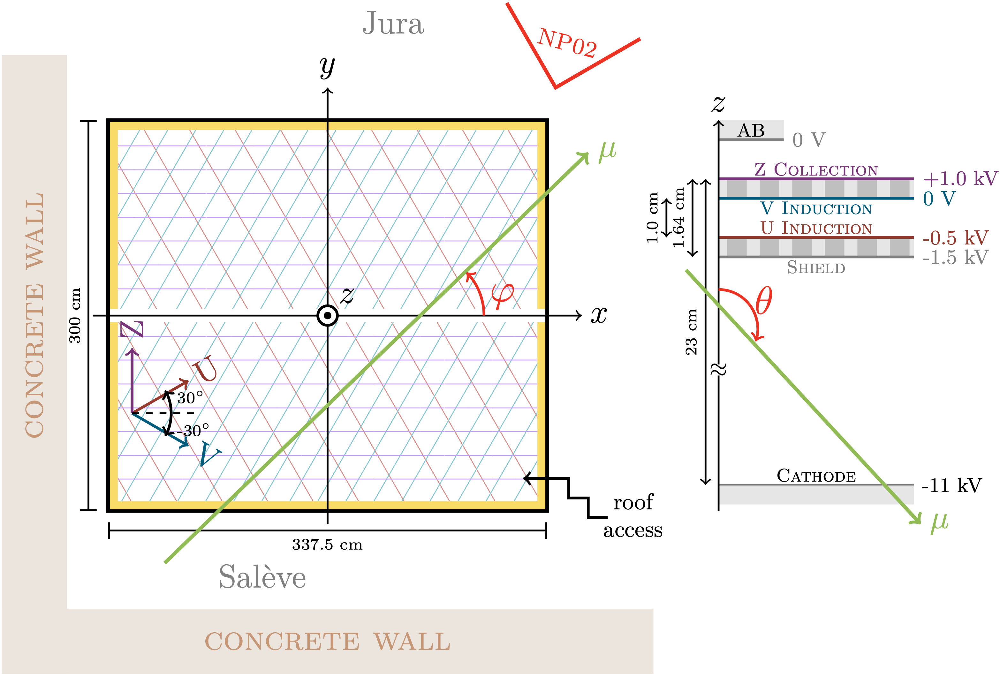

# Liquid Argon Reconstruction Done in PythON

## Librairies needed to run lardon
You need miniconda installed :

https://docs.conda.io/en/latest/miniconda.html#linux-installers

and then get the librairies as stated in **lardenv.yml** :

`conda env create -f lardenv.yml`

 :warning: It'll take about 2-3 GB of space!

then : `conda activate lardenv`
 
## Before running lardon
Check and modify **config.py** and files in `settings/` :
* *store_path* : your directory where the output file will be stored
* *plot_path*  : your directory where control plots will be stored
* Update the detector & runs configuration files in `settings/` if needed

## To run lardon on data
To launch lardon, type `python lardon.py` with the following arguments: 
**Mandatory**: 
* `-det <cb1top/cb1bot/cbtop/cbbot/dp/50l>` which detector 
* `-run <run nb>` which run number
* `-sub <subfile name>` which subfile (*e.g.* 1_a, 0) 
*Optional*: 
* `-n <nb of events>` how many events to process, default is -1 = all file
* `-out <output file option>` optional extra name for the output
* `-skip <nb to skip>` number of events to skip
* `-pulse` To analyse charge pulsing (calibration) data
* `-pds` To also reconstruct the PDS data

*e.g. 1* : To run the first 10 events of top electronics run 1740 subfile 5_b, type :

`python lardon.py -det cbtop -run 1740 -sub 5_b -n 10 -out example`

the output h5file will be **store_path/cbtop_1740_5_b_example.h5**

*e.g. 2* : To run all events of bottom electronics run 20199 subfile 0, type :

`python lardon.py -det cbbot -run 20199 -sub 0 -out full_example`

the output h5file will be **store_path/cbbot_20199_0_full_example.h5**

*e.g. 3* : To run the 5th event of bottom electronics run 23868 subfile 23 with the PDS reconstruction, type:

`python lardon.py -det cbbot -run 23868 -sub 23 -n 6 -skip 5 -pds -out one_event`

the output h5file will be **store_path/cbbot_23868_23_one_event.h5**

## lardon Convention
# Coldbox 2nd period

* electrons drift along z axis
* the origin of the (x,y,z) system is at the center of the detector
* all distance are in cm

## Control Plots
:warning: The data is structured in `daq_channel` ordering, which can have a mix of views 

By default, no control plots is produced, but you can call the plotting functions in **lardon.py** anywhere in the reconstruction loop.

All plot functions have the two options : 
* option="extra_output_name_if_you_want" [default is none] 
* to_be_shown=True/False if you want to see the plot live [default is False]

### To plot the current event display: 
Seen in `daq_channel` ordering: 
`plot.plot_event_display_per_daqch()` 
Seen in view channel ordering (more natural): 
`plot.plot_event_display_per_view()` 

### To plot the current waveform(s): 
`plot.plot_wvf_current_daqch([daq_ch_1, daq_ch_2, ...])` 
`plot.plot_wvf_current_vch([(view,ch1),(view,ch2),(...)])` 

### To plot the noise RMS 
`plot.plot_noise_daqch(noise_type='noise_type')` 
`plot.plot_noise_vch(noise_type='noise_type')` 
where `noise_type` is either `raw` or `filt` 

### To check the signal/noise separation on the event display: 
The signal (ROI) : `plot.event_display_per_view_roi()` 
The noise : `plot.event_display_per_view_noise()` 
The found hits on the ED: `plot.event_display_per_view_hits_found()` 

### To plot hits found : 
`plot.plot_2dview_hits()` 

### To plot 2D tracks (and hits): 
`plot.plot_2dview_2dtracks()` 

### To plot 3D tracks: 
`plot.plot_2dview_hits_and_3dtracks()` <- see the 3D tracks projected in 2D 
`plot.plot_3d()` <- see the 3D tracks in 3D 

### To plot the PDS waveforms: 
`plot.draw_pds_ED(draw_peak=True, roi=True)` <- also shows the reconstructed PDS peaks and ROI
